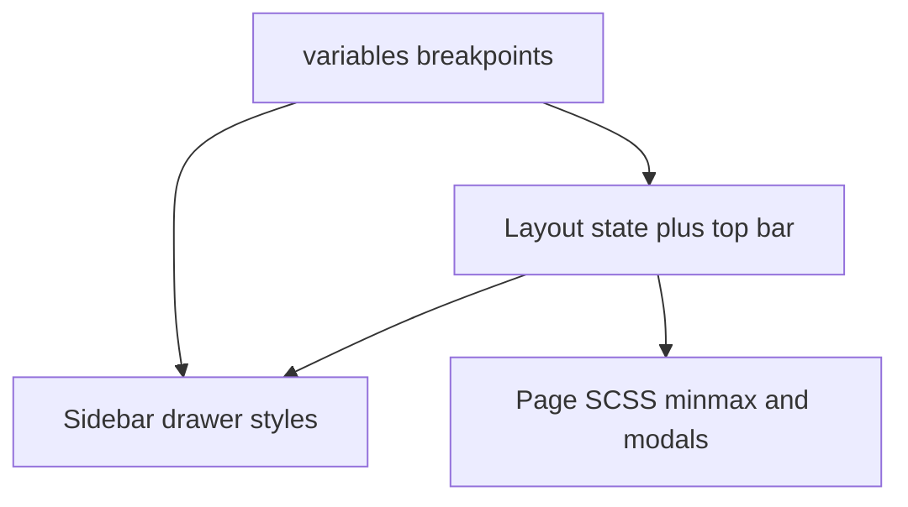

# Web app — phone-friendly layout (`apps/web`)

## Problem statement

The app viewport meta is already correct ([`apps/web/index.html`](apps/web/index.html)). The main gap is the **persistent sidebar**: [`Layout.tsx`](apps/web/src/components/Layout/Layout.tsx) renders [`Sidebar`](apps/web/src/components/Layout/Sidebar.tsx) in a horizontal flex with [`Sidebar.scss`](apps/web/src/components/Layout/Sidebar.scss) **`min-width: 12rem`** and **`width: 20%`**, which leaves too little horizontal space for main content on small phones (~360px and below).

Several feature SCSS files already include `@media` rules (e.g. [`CoachContextBar.scss`](apps/web/src/components/CoachContextBar/CoachContextBar.scss), [`TraineeManager.scss`](apps/web/src/containers/TraineeManager/TraineeManager.scss), [`TraineeDashboard.scss`](apps/web/src/components/TraineeDashboard/TraineeDashboard.scss)); those remain valid once the shell gives the main column full width.

## Target behavior

- **Desktop / tablet (above breakpoint):** Current side-by-side layout unchanged (or optionally slightly wider breakpoint so large tablets keep sidebar).
- **Phone / narrow viewport:** Sidebar becomes an **off-canvas drawer** with a **visible menu control** in the shell; **main** uses **full width**; tapping backdrop or navigating closes the drawer.

## Implementation plan

### 1. Shared breakpoints

- Extend [`apps/web/src/styles/variables.scss`](apps/web/src/styles/variables.scss) with documented tokens, for example:
  - **`$bp-nav`**: `900px` (or `768px` if you prefer alignment with existing `Layout.scss` 768px rule) — when navigation switches to drawer mode.
  - **`$bp-sm`**: `480px` — optional fine-tuning for typography and tight grids.
- Import and use these in [`Layout.scss`](apps/web/src/components/Layout/Layout.scss) and [`Sidebar.scss`](apps/web/src/components/Layout/Sidebar.scss) instead of duplicating raw pixel values.

### 2. Mobile navigation shell (highest priority)

**[`apps/web/src/components/Layout/Layout.tsx`](apps/web/src/components/Layout/Layout.tsx)**

- Add React state: `navOpen` (boolean).
- Render a **top bar** (or bar above `CoachContextBar`) visible only under `$bp-nav` via CSS class on the layout root, containing:
  - **Menu button** (`lucide-react` `Menu` when closed, `X` when open) with minimum **44px** hit target for touch.
  - Optional short app title for context.
- Pass to `Sidebar`: `isOpen`, `onClose`, and wrap `onNavigate` so that after `onNavigate(page)` the drawer **closes** on narrow viewports (either always close on navigate, or close when `window.matchMedia` matches `$bp-nav` — simplest is always close on navigate).

**[`apps/web/src/components/Layout/Layout.scss`](apps/web/src/components/Layout/Layout.scss)**

- Below `$bp-nav`:
  - **`.layout-container`**: keep `flex` row if sidebar is in DOM but sidebar becomes **fixed** full-height panel; **`.main-content`** `flex: 1` and **width: 100%** when drawer closed.
  - **Backdrop**: semi-transparent full-screen layer when `navOpen`, `z-index` between main and sidebar; `pointer-events` and click handler from React to call `setNavOpen(false)`.
  - **Body scroll**: optional `overflow: hidden` on `body` when drawer open (class on `document.documentElement` or `body` from `useEffect` in Layout) to reduce background scroll on iOS.

**[`apps/web/src/components/Layout/Sidebar.tsx`](apps/web/src/components/Layout/Sidebar.tsx)**

- Accept optional props: `isOpen?: boolean`, `onClose?: () => void`.
- Merge className on root `aside` e.g. `sidebar sidebar--drawer` when in mobile mode (class toggled by parent based on media query is awkward in pure CSS — prefer **parent passes `mobileLayout`** boolean from a `useMediaQuery` hook or **CSS-only** transform using `:has()` is not universally safe; **React `matchMedia` listener** or **resize** to set `isMobile` on Layout is reliable).
- Invoke `onClose` after each nav item click when `onClose` is provided.

**[`apps/web/src/components/Layout/Sidebar.scss`](apps/web/src/components/Layout/Sidebar.scss)**

- Default (wide): unchanged styles.
- Below `$bp-nav`:
  - Sidebar **fixed** left, top 0, bottom 0, width `min(18rem, 85vw)`, `transform: translateX(-100%)` when closed, `translateX(0)` when open, `z-index` above main (e.g. 200) and below app modals (TraineeManager uses ~800 — keep sidebar below modals).
  - Remove `width: 20%` / competing flex sizing in this mode.

**Optional:** `prefers-reduced-motion: reduce` — shorten or disable `transition` on drawer transform.

### 3. Page-level tuning (after shell)

Re-test on ~360px width (Chrome device toolbar).

- [`TraineeDashboard.scss`](apps/web/src/components/TraineeDashboard/TraineeDashboard.scss): if horizontal scroll remains, reduce **`minmax(300px, 1fr)`** minimums on the smallest breakpoint (already has 900px / 520px blocks — extend or add **`$bp-sm`** rule).
- [`GoalsOverview.scss`](apps/web/src/containers/TraineeHome/components/GoalsOverview.scss): **`minmax(260px, 1fr)`** — consider **`minmax(min(260px, 100%), 1fr)`** or lower floor under `$bp-sm`.
- [`PaymentsPage.scss`](apps/web/src/containers/Payments/PaymentsPage.scss): confirm cards and tables do not exceed `100vw` minus padding.
- Modals ([`WorkoutSessionModal.scss`](apps/web/src/components/TraineeWorkoutPanel/WorkoutSessionModal.scss), etc.): **`max-width: min(560px, 100vw - 2rem)`** pattern where missing; safe horizontal padding.

### 4. Verification

- Manual: iPhone SE / 375px and 360px widths — no persistent horizontal scroll on coach and trainee primary flows (home, workouts, nutrition, settings).
- Ensure **Firebase / production** hosting build unchanged (`nx run web:build`).

## Architecture (high level)

## Out of scope (unless requested later)

- PWA / installability, service worker, or native app shells.
- Redesign of information architecture (tab bar vs. drawer) beyond the drawer pattern above.
